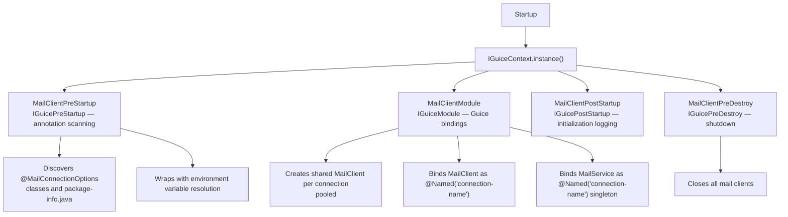
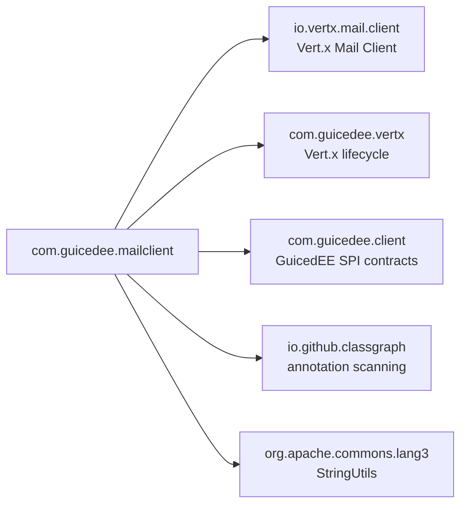

# GuicedEE Mail Client

[](https://github.com/GuicedEE/GuicedMailClient/actions/workflows/build.yml)
[](https://central.sonatype.com/artifact/com.guicedee/mail-client)
[](https://www.apache.org/licenses/LICENSE-2.0)


**Annotation-driven SMTP mail client** for the [GuicedEE](https://github.com/GuicedEE) / Vert.x stack.
Declare SMTP connections with annotations — everything is discovered at startup via ClassGraph, wired through Guice, and managed by the Vert.x Mail Client with connection pooling.

Built on [Vert.x Mail Client](https://vertx.io/docs/vertx-mail-client/java/) · [Google Guice](https://github.com/google/guice) · JPMS module `com.guicedee.mailclient` · Java 25+

## 📦 Installation

```xml
<dependency>
  <groupId>com.guicedee</groupId>
  <artifactId>mail-client</artifactId>
</dependency>
```

<details>
<summary>Gradle (Kotlin DSL)</summary>

```kotlin
implementation("com.guicedee:mail-client:2.0.2-SNAPSHOT")
```
</details>

## ✨ Features

- **Annotation-driven setup** — `@MailConnectionOptions` declares the entire SMTP configuration
- **Auto-discovery** — `MailClientPreStartup` scans the classpath via ClassGraph to find all annotated connection declarations
- **Guice-managed mail service** — `MailService` instances are injectable by `@Named("connection-name")` with convenience send methods
- **Connection pooling** — shared Vert.x `MailClient` instances with configurable pool size
- **StartTLS & SSL** — full TLS configuration with `DISABLED`, `OPTIONAL`, or `REQUIRED` modes
- **DKIM signing** — enable DomainKeys Identified Mail signature signing
- **Default from address** — configurable per-connection default sender
- **Attachments** — full `MailMessage` API for attachments, inline images, CC/BCC, HTML, and multipart
- **Environment variable overrides** — every annotation attribute can be overridden via system properties or environment variables at runtime
- **Graceful shutdown** — all mail clients are closed on application shutdown

## 🚀 Quick Start

**Step 1** — Define a connection. Place `@MailConnectionOptions` on a class or `package-info.java`:

```java
@MailConnectionOptions(
        value = "notifications",
        hostname = "smtp.example.com",
        port = 587,
        startTls = MailConnectionOptions.StartTLSMode.REQUIRED,
        login = MailConnectionOptions.LoginMode.REQUIRED,
        username = "user@example.com",
        password = "secret",
        defaultFrom = "noreply@example.com"
)
package com.example.mail;
```

Or on a class:

```java
@MailConnectionOptions(
    value = "notifications",
    hostname = "smtp.example.com",
    port = 587,
    startTls = MailConnectionOptions.StartTLSMode.REQUIRED,
    login = MailConnectionOptions.LoginMode.REQUIRED,
    username = "user@example.com",
    password = "secret",
    defaultFrom = "noreply@example.com"
)
public class MailConfig {
}
```

**Step 2** — Inject and send:

```java
public class NotificationService {

    @Inject
    @Named("notifications")
    private MailService mailService;

    public void sendWelcome(String to) {
        mailService.sendHtml(to, "Welcome!", "<h1>Welcome aboard!</h1>");
    }

    public void sendReport(String to) {
        mailService.sendText(to, "Daily Report", "Here is your daily report...");
    }
}
```

**Step 3** — Configure `module-info.java`:

```java
module my.app {
    requires com.guicedee.mailclient;
    opens my.app.mail to com.google.guice, com.guicedee.mailclient;
}
```

**Step 4** — Bootstrap GuicedEE:

```java
IGuiceContext.instance().inject();
```

That's it. `MailClientPreStartup` discovers the annotations, `MailClientModule` creates the Guice bindings with shared pooled mail clients, and your `MailService` is ready to send.

## 📐 Architecture



### Send lifecycle

```
Send:
  MailService.sendHtml(to, subject, html)
   → MailMessage (auto-fills from if defaultFrom set)
   → MailClient.sendMail(message)
   → Future<MailResult> (messageId, recipients)
```

## 🔧 Annotations

### `@MailConnectionOptions`

Placed on a class or `package-info.java` to declare an SMTP connection:

| Attribute | Default | Purpose |
|---|---|---|
| `value` | `"default"` | Connection name (used for `@Named` binding) |
| `hostname` | `"localhost"` | SMTP server hostname |
| `port` | `25` | SMTP server port |
| `startTls` | `OPTIONAL` | StartTLS mode: `DISABLED`, `OPTIONAL`, `REQUIRED` |
| `login` | `NONE` | Login mode: `DISABLED`, `NONE`, `REQUIRED` |
| `username` | `""` | SMTP authentication username |
| `password` | `""` | SMTP authentication password |
| `ssl` | `false` | Use SSL on connect (port 465) |
| `trustAll` | `false` | Trust all server certificates |
| `ehloHostname` | `""` | EHLO hostname for message-id generation |
| `authMethods` | `""` | Space-separated allowed auth methods |
| `keepAlive` | `true` | Enable connection pooling |
| `maxPoolSize` | `10` | Maximum pool connections |
| `allowRcptErrors` | `false` | Continue if a recipient is rejected |
| `disableEsmtp` | `false` | Disable ESMTP commands |
| `userAgent` | `""` | Mail user agent name |
| `enableDkim` | `false` | Enable DKIM signature signing |
| `pipelining` | `true` | Enable SMTP pipelining |
| `maxMailsPerConnection` | `0` | Max emails per connection (0 = unlimited) |
| `keepAliveTimeout` | `300` | Keep-alive timeout in seconds |
| `defaultFrom` | `""` | Default sender address |

## 📤 Sending Emails

### Simple methods

```java
@Inject
@Named("notifications")
private MailService mailService;

// Plain text (uses default from)
mailService.sendText("user@example.com", "Subject", "Body text");

// Plain text (explicit from)
mailService.sendText("from@example.com", "user@example.com", "Subject", "Body text");

// HTML (uses default from)
mailService.sendHtml("user@example.com", "Subject", "<h1>Hello</h1>");

// HTML (explicit from)
mailService.sendHtml("from@example.com", "user@example.com", "Subject", "<h1>Hello</h1>");

// Multipart (text + HTML)
mailService.sendMultipart("from@example.com", List.of("a@ex.com", "b@ex.com"),
    "Subject", "Plain text fallback", "<h1>HTML body</h1>");
```

### Full MailMessage API

For attachments, inline images, CC/BCC, custom headers:

```java
MailMessage message = new MailMessage()
    .setTo("user@example.com")
    .setCc("cc@example.com")
    .setBcc("bcc@example.com")
    .setSubject("Report with attachment")
    .setText("See attached report.")
    .setHtml("<p>See attached <b>report</b>.</p>")
    .setAttachment(List.of(
        MailAttachment.create()
            .setContentType("application/pdf")
            .setName("report.pdf")
            .setData(Buffer.buffer(pdfBytes))
    ));

mailService.send(message);  // auto-fills from if defaultFrom is set
```

### MailService methods

| Method | Return | Description |
|---|---|---|
| `send(MailMessage)` | `Future<MailResult>` | Send pre-built message (auto-fills from) |
| `sendText(to, subject, text)` | `Future<MailResult>` | Plain text using default from |
| `sendText(from, to, subject, text)` | `Future<MailResult>` | Plain text with explicit from |
| `sendHtml(to, subject, html)` | `Future<MailResult>` | HTML using default from |
| `sendHtml(from, to, subject, html)` | `Future<MailResult>` | HTML with explicit from |
| `sendMultipart(from, to, subject, text, html)` | `Future<MailResult>` | Multipart (text + HTML) |
| `getMailClient()` | `MailClient` | Access underlying Vert.x client |
| `getConnectionName()` | `String` | Logical connection name |
| `getDefaultFrom()` | `String` | Default from address |

## ⚙️ Environment Variable Overrides

All annotation attributes can be overridden at runtime via system properties or environment variables. Overrides are **scoped by name** — the lookup tries a name-specific key first, then falls back to a global key:

1. `MAIL_{NORMALIZED_NAME}_{PROPERTY}` — name-specific override
2. `MAIL_{PROPERTY}` — global fallback
3. Annotation default

The name is normalized to uppercase with hyphens and dots replaced by underscores. For example, a connection named `order-notifications` checking the `HOSTNAME` property would resolve:
1. `MAIL_ORDER_NOTIFICATIONS_HOSTNAME` (name-specific)
2. `MAIL_HOSTNAME` (global fallback)
3. The `hostname` attribute from the `@MailConnectionOptions` annotation

### Connection overrides (`@MailConnectionOptions`)

| Property | Variable pattern |
|---|---|
| `value()` | `MAIL_{name}_CONNECTION_NAME` / `MAIL_CONNECTION_NAME` |
| `hostname()` | `MAIL_{name}_HOSTNAME` / `MAIL_HOSTNAME` |
| `port()` | `MAIL_{name}_PORT` / `MAIL_PORT` |
| `startTls()` | `MAIL_{name}_START_TLS` / `MAIL_START_TLS` |
| `login()` | `MAIL_{name}_LOGIN` / `MAIL_LOGIN` |
| `username()` | `MAIL_{name}_USERNAME` / `MAIL_USERNAME` |
| `password()` | `MAIL_{name}_PASSWORD` / `MAIL_PASSWORD` |
| `ssl()` | `MAIL_{name}_SSL` / `MAIL_SSL` |
| `trustAll()` | `MAIL_{name}_TRUST_ALL` / `MAIL_TRUST_ALL` |
| `ehloHostname()` | `MAIL_{name}_EHLO_HOSTNAME` / `MAIL_EHLO_HOSTNAME` |
| `authMethods()` | `MAIL_{name}_AUTH_METHODS` / `MAIL_AUTH_METHODS` |
| `keepAlive()` | `MAIL_{name}_KEEP_ALIVE` / `MAIL_KEEP_ALIVE` |
| `maxPoolSize()` | `MAIL_{name}_MAX_POOL_SIZE` / `MAIL_MAX_POOL_SIZE` |
| `allowRcptErrors()` | `MAIL_{name}_ALLOW_RCPT_ERRORS` / `MAIL_ALLOW_RCPT_ERRORS` |
| `disableEsmtp()` | `MAIL_{name}_DISABLE_ESMTP` / `MAIL_DISABLE_ESMTP` |
| `userAgent()` | `MAIL_{name}_USER_AGENT` / `MAIL_USER_AGENT` |
| `enableDkim()` | `MAIL_{name}_ENABLE_DKIM` / `MAIL_ENABLE_DKIM` |
| `pipelining()` | `MAIL_{name}_PIPELINING` / `MAIL_PIPELINING` |
| `maxMailsPerConnection()` | `MAIL_{name}_MAX_MAILS_PER_CONNECTION` / `MAIL_MAX_MAILS_PER_CONNECTION` |
| `keepAliveTimeout()` | `MAIL_{name}_KEEP_ALIVE_TIMEOUT` / `MAIL_KEEP_ALIVE_TIMEOUT` |
| `defaultFrom()` | `MAIL_{name}_DEFAULT_FROM` / `MAIL_DEFAULT_FROM` |

## 💉 Dependency Injection

### Named bindings

| Type | Named by | Example |
|---|---|---|
| `MailService` | Connection name | `@Named("notifications") MailService mailService` |
| `MailClient` | Connection name | `@Named("notifications") MailClient client` |

### Injecting the raw Vert.x MailClient

```java
@Inject
@Named("notifications")
private MailClient mailClient;
```

## 🗺️ Module Graph



## 🧩 JPMS

Module name: **`com.guicedee.mailclient`**

The module:
- **exports** `com.guicedee.mailclient`, `com.guicedee.mailclient.implementations`
- **provides** `IGuicePreStartup` with `MailClientPreStartup`
- **provides** `IGuiceModule` with `MailClientModule`
- **provides** `IGuicePostStartup` with `MailClientPostStartup`
- **provides** `IGuicePreDestroy` with `MailClientPreDestroy`
- **opens** `com.guicedee.mailclient`, `com.guicedee.mailclient.implementations` to `com.google.guice` and `com.fasterxml.jackson.databind`

## 🏗️ Key Classes

| Class | Package | Role |
|---|---|---|
| `MailConnectionOptions` | `mailclient` | Annotation declaring an SMTP connection with all configuration options |
| `MailService` | `mailclient` | High-level mail service with convenience send methods (text, HTML, multipart) |
| `MailClientPreStartup` | `implementations` | `IGuicePreStartup` — scans for all `@MailConnectionOptions` and registers metadata |
| `MailClientModule` | `implementations` | `IGuiceModule` — creates shared `MailClient` instances and binds `MailService` |
| `MailClientPostStartup` | `implementations` | `IGuicePostStartup` — initialization logging |
| `MailClientPreDestroy` | `implementations` | `IGuicePreDestroy` — closes all mail clients on shutdown |

## 🧪 Testing

The test suite validates annotation scanning, Guice binding, and `MailService` injection without requiring a real SMTP server:

```java
@BeforeAll
static void init() {
    IGuiceContext.registerModule("com.guicedee.mailclient.test");
    IGuiceContext.instance().inject();
}

@Test
void testMailServiceBound() {
    var service = IGuiceContext.get(Key.get(MailService.class, Names.named("test-smtp")));
    assertNotNull(service);
    assertEquals("test-smtp", service.getConnectionName());
    assertEquals("test@example.com", service.getDefaultFrom());
}
```

Run tests:

```bash
mvn test
```

## 🤝 Contributing

Issues and pull requests are welcome — please add tests for new connection options or mail service features.

## 📄 License

[Apache 2.0](https://www.apache.org/licenses/LICENSE-2.0)

